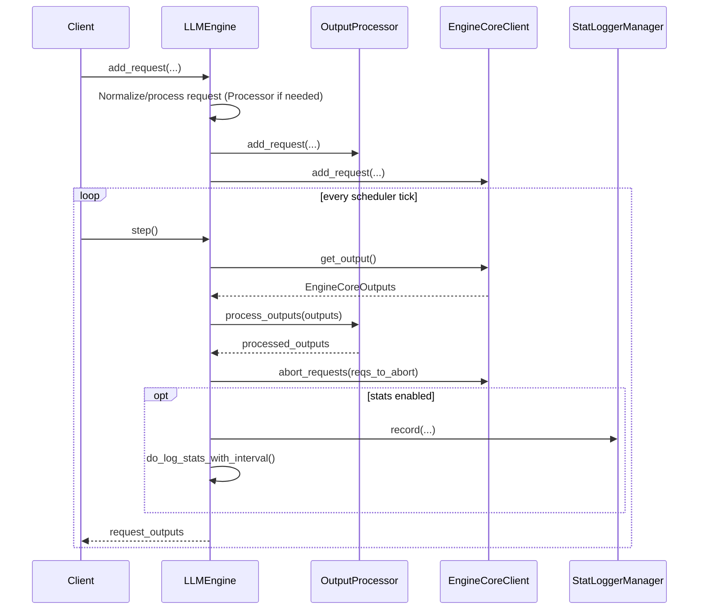

# `vllm/v1/engine/llm_engine.py` Code Flow Diagram

This document summarizes the runtime flow of `LLMEngine` in `vllm/v1/engine/llm_engine.py`.

## High-level flow

```mermaid
flowchart TD
    A[Construct LLMEngine] --> B[__init__]
    B --> C[Initialize tokenizer + Processor + IO processor]
    C --> D[Create OutputProcessor]
    D --> E[Create EngineCore client]
    E --> F[Optional stat logger manager]
    F --> G[Reset multimodal cache]

    H[add_request] --> I{prompt is EngineCoreRequest?}
    I -- yes --> J[Use request directly]
    I -- no --> K[Processor.process_inputs]
    K --> L[Extract prompt_text]
    J --> M[Compute n from params]
    L --> M
    M --> N{n == 1?}
    N -- yes --> O[OutputProcessor.add_request]
    O --> P[EngineCore.add_request]
    N -- no --> Q[Create ParentRequest]
    Q --> R[Fan out child requests]
    R --> S[OutputProcessor.add_request per child]
    S --> T[EngineCore.add_request per child]

    U[step] --> V{should_execute_dummy_batch?}
    V -- yes --> W[EngineCore.execute_dummy_batch and return []]
    V -- no --> X[EngineCore.get_output]
    X --> Y[OutputProcessor.process_outputs]
    Y --> Z[OutputProcessor.update_scheduler_stats]
    Z --> AA[EngineCore.abort_requests for stop-string exits]
    AA --> AB{log_stats enabled?}
    AB -- yes --> AC[StatLoggerManager.record + interval logging]
    AB -- no --> AD[Skip logging]
    AC --> AE[Return request outputs]
    AD --> AE

    AF[has_unfinished_requests] --> AG{dp_group is None?}
    AG -- yes --> AH[local unfinished OR EngineCore.dp_engines_running]
    AG -- no --> AI[ParallelConfig.has_unfinished_dp]
    AI --> AJ[Set should_execute_dummy_batch if needed]

    AK[Lifecycle helpers] --> AL[profile/sleep/wake/reset cache/get_metrics]
    AM[LoRA helpers] --> AN[add/remove/list/pin via EngineCore]
    AO[collective_rpc/apply_model] --> AP[Distributed worker RPC]
```

## Sequence view of one decoding iteration



## Key decision points

- **DP synchronization path:** `has_unfinished_requests()` switches between local check and DP-aggregated check; if this rank is idle but others are active, it triggers `should_execute_dummy_batch` on the next `step()`.  
- **Parallel sampling fan-out:** `add_request()` clones/fans out requests when `SamplingParams.n > 1` and tracks parent-child mapping via `ParentRequest`.  
- **Logging path:** Iteration stats are generated only when `log_stats=True` and flushed periodically through `do_log_stats_with_interval()`.
